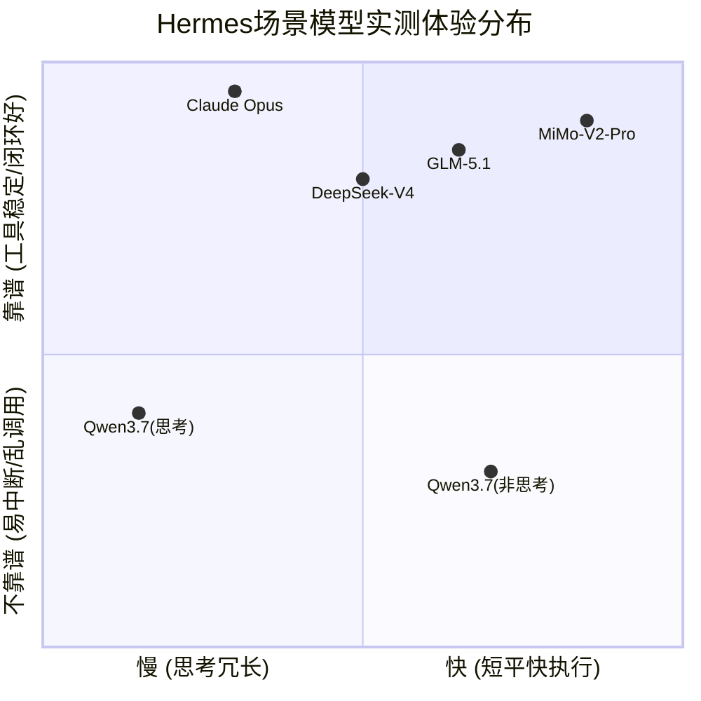

# LLM 过度思考批判

**状态**：团队技术共识
**日期**：2026-06-22
**核心命题**：面向 Benchmark 的深度推理优化与真实软件工程需求存在根本性错配——跑分越高，干活越差

> 大模型当前面临"高不就、低不就"的死局。其根源在于：模型团队在资本与学术 KPI 裹挟下选择了面向 Bench 的"深度思考"技术路线，这与真实软件工程的"广度串联"本质、资深开发者的核心诉求，以及大模型自身的物理/逻辑天花板发生了全方位的致命错配。

---

## 1. 核心悖论：草稿本的双重人格

自回归 LLM 没有内部工作内存，只是"下一字概率预测器"。显式草稿本（`<think>`）充当物理缓冲区——如果模型在第一步写错一个字符，概率链条断裂，后续几千字全部沦为幻觉。草稿本允许模型在吐出真实代码前，在脑内犯错、划掉、重来、完成自我净化。

**但在厚 Harness 环境中，外部 Harness 本身就是终极草稿本。**

LSP、编译器（`cargo check`）、测试运行器是 100% 确定性的真实物理评估引擎。如果推理模型在 `<think>` 里花 30 秒去模拟"Rust 编译器会怎么看这个生命周期错误"，就是在用极其昂贵且缓慢的注意力机制做无用功——真实编译器 10ms 内给出最精准答案。

**厚 Harness 不需要深度 CoT 的三个理由**：
- **外置纠偏等价于脑内推演**：现代 IDE 和 Agent 框架具备"读取代码→报错标红→运行测试→反馈修复"的完整物理闭环，远比模型脑内模拟编译器更高效、更具确定性。
- **过度思考摧毁心流**：推理模型在厚 Harness 长上下文污染下，极易触发无病呻吟的反思，产生极高首字延迟。
- **商业算力灾难**：低难度场景常规模型直觉准确率已 95%+，为 0.5% 提升让用户傻等数千隐藏思考 Token，ROI 严重过度工程。

→ 驯服配置详见 [技术复盘备忘录 附录 C](qwen-to-mimo-migration.md#c1-厚-harness-驯服铁律)

---

## 2. 工程本质论：复杂度下沉与广度排障

### 2.1 复杂度洋葱：下沉而非消失

软件工程的复杂度不会消失，只会下沉。底层协议、GC、并发被封装进框架和库，以换取技术的普及。

### 2.2 日常工程：广度试错，非深度推演

真实应用的系统复杂度，本质是"组件交互的广度"。排障并非单点逻辑的深度推演，而是在不同层级调用几十个工具（查日志、看监控、链路追踪）完成的长链路试错。难点在于广度与琐碎度。

即使遇到底层框架 Bug 被迫"撕开封装"，本质也只是进入了下一层洋葱皮的"广度试错"。若真遇到需要极致深度推演的底层状态机问题，大模型同样无能为力。

**结论**：日常工程需要的是"广度串联、快、抗摩擦"，不需要过度思考。

### 2.3 开发者分层与诉求错位

**用户分层**：初级开发者缺乏工程毒打，盲信 AI"无所不能"；资深开发者敬畏复杂系统，对 AI 保持克制。

**诉求错位**：对资深者而言，架构设计是享受创造秩序的"智力娱乐"（不愿让渡给 AI），而枯燥的 Debug 排障才是最需 AI 代劳的"苦力活"。

**现实讽刺**：模型拼命卷代码生成和架构（迎合初级者、好出 Demo 刷榜），却对繁琐的 Debug 工具链串联避而不谈，精准避开了资深开发者的真实痛点。

---

## 3. Bench 优化的荒谬与错配

### 3.1 方向性错配

大量模型面向 Bench（如生成骑自行车的鹈鹕、许愿式编程）进行极端优化，强行注入"深度推理"轨迹。

**矛盾点**：日常工程需要的是"广度串联"和"快"，而 Bench 优化强化了"深度思考"。这导致模型试图用"深度逻辑推演"去解决本质上需要"广度工具试错"的日常问题，产生严重的方向性错配。

**定论**：跑分越高，日常干活反而越卡顿。面向 Bench 的极端优化不仅无益于真实生产力，反而成为了执行链路中沉重的包袱。

### 3.2 Bench 是"许愿式编程"的假战场

许愿式编程——几百字的要求做一个项目——是 Bench 测试的典型范式。比如"生成一只骑自行车的鹈鹕"。

但问题是：**没有一个模型能写出一个可用的鹈鹕。** 而鹈鹕和真实应用比起来，复杂度差了几个数量级。

这里存在一个根本性的认知错位：

- **非平凡应用**（如鹈鹕）：从零构建一个完整的、能运行的项目。这看起来"需要智能"，但实际测试中，没有模型能真正完成——所谓"跑分高"只是"看起来更接近完成"。而且，鹈鹕的复杂度远远低于真实业务系统。
- **平凡应用**：直接用现成的框架和库糊起来，能改 Bug 就行。**不需要太高的智能，关键是快和顺手。** 这才是日常工程的真实面貌。

Bench 测试的真正问题不在于"测试本身没意义"——它确实能区分模型的基础能力边界。但**极端优化 Bench 是荒谬的**，因为它测的是"从零构建非平凡应用"的能力，而这恰恰是日常工程中最不需要的能力。你花 10 倍算力去优化一个"生成鹈鹕"的分数，不如把"在现有代码库里快速定位并修复 Bug"的体验做好 1%。

**类比**：这就像高考数学满分的学生未必能做好工厂的质检工作。Bench 测的是"解题能力"，而工程需要的是"在既有体系内快速定位问题并修复的能力"——两个完全不同的维度。

### 3.3 舆论与认知陷阱：为什么"纸面榜单"会误导你

| 云评测逻辑 | 工程实战逻辑 |
|-----------|-------------|
| "思考时间越长 = 模型越聪明 = 梯队越高" | 思考时间越长 = 首字延迟越高 = 开发心流断裂 |
| "API 单价越贵 = 参数量越大 = 落地效果越好" | 单价越贵 = Token 账单越容易失控 = ROI 崩溃 |
| "榜单分数 T0 = 生产环境 T0" | 榜单用奥数题测，生产用高频工具调用测，完全是两个世界 |

这种评测方法从未在 Zed 里被模型卡死过心流，也从未在 Hermes 的厚 Harness 里被思维链重复计费烧掉过几百块钱，更没有经历过线上生产环境中"关了思考模式连 URL 都能拼错"的困境。

### 3.4 三个恶劣后果

**1. 制造"技术巨婴"崇拜，扼杀新手的工程常识**
当铺天盖地的评测都在无脑高喊"Qwen Max/GLM-5.2 是 T0 顶尖"时，刚入行的初学者会盲目押注大厂的"强推理模型"。他们根本不知道软件工程里有"开发心流"和"首字延迟"这两个决定生死命脉的指标。当模型频繁卡顿时，新手甚至怀疑是自己的代码有问题。

**2. 引导企业走向 ROI 破产**
听信"公认梯队"接入高单价旗舰推理模型，上线后遭遇"打招呼一分钟不吭声"和"每天好几百"的刺客账单。关了思考后又严重降智（连 URL 都拼不对），进退两难。

**3. 掩盖真正优秀的"纯血工程流"模型**
像 MiMo 这种不演内心戏、高 TPS 且低成本的模型，在云评测眼里因参数量或思维链长度不够，直接被贬为"低端模型"。实战开发者错过了真正能陪他们加班熬夜的生产力利器。

### 3.5 为什么大环境会变成这样？

因为"看榜单打分"太容易了，而"做肉身实测"太难了。媒体和云评测只需要用几道奥数题测模型，推理模型内部思考 10 分钟后确实能给出满分答案，于是大家欢呼"T0 诞生了"。只有真正把它丢进 Hermes 的厚 Harness，让它面对高频工具调用时，大厂模型金漆外表下的工程溃败才会暴露无遗。

### 3.6 自检清单：你的模型选型是否被榜单绑架？

- [ ] 你是否因为"某个模型榜单分数高"就选了它，而没有在实际项目里测过？
- [ ] 你的模型是否在厚 Harness 场景下频繁卡顿或断流？
- [ ] 你的 Token 账单是否远超预期（每天几百元）？
- [ ] 关闭思考模式后，模型是否出现明显的降智（格式混乱、URL 拼接错误）？
- [ ] 你的团队是否因为模型问题导致开发心流频繁被打断？

如果以上问题有 3 个以上回答"是"，你的模型选型可能被榜单绑架了。

### 3.7 Hermes 场景模型实测体验分布

#### 四象限定位图

#### 四象限实际表现

**第一象限（右上）：干活神队友**
- **MiMo-V2-Pro**：速度极快，干活极稳。"短思考"不是偷懒，是工程优化到位——不产生无用 Token，直接规划最短工具调用路径。
- **GLM-5.1**：国产模型里 Agent 基因最好的之一。工具调用格式遵循度极高，需要一点深度规划时成功率很高。

**第四象限（右下）：快但容易翻车**
- **Qwen3.7（非思考模式）**：关了思考确实快，但容易"莽撞"——没完全理解上下文就开始调工具，参数填错，逻辑断裂。

**第三象限（左下）：又慢又容易废**
- **Qwen3.7（思考模式）**：为推演一个工具调用参数能"想"出一篇小论文。等花儿都谢了，最后可能还因上下文太长忘了关键信息。

**第二象限（左上）：靠谱但太慢**
- **Claude Opus 4.8**：工具调用绝对靠谱，但"慢"是贵族式的从容。适合不赶时间、追求一次成功的关键任务。

#### Hermes 场景实战优先级排序

1. **MiMo-V2-Pro（首选）**：综合体验最好，速度和稳定性平衡极佳，成本还低。
2. **GLM-5.1（次选）**：需要稍微复杂一点的任务规划时用它，比 MiMo 更稳一点，但速度会慢下来。
3. **DeepSeek-V4（特定场景）**：写代码、调 Bug 时很猛，但纯 Agent 调度时有时会陷入代码思维。
4. **Claude Opus 4.8（备用兜底）**：其他模型都搞不定、或任务极其重要不能出错时请出这位老爷子。
5. **Qwen3.7（不推荐）**：无论开不开思考，Hermes 场景下体验都打折扣。

---

## 4. 高智力边界层：大模型的绝对天花板

### 4.1 本质缺陷

大语言模型是概率预测机，擅长模式匹配，缺乏真正的多维逻辑演绎能力。

### 4.2 架构设计的死穴

AI 懂设计模式但"视野广却低"，只能扁平拼凑，缺乏在时间、业务、性能等多维度进行动态全局权衡的能力，因此毫无实战价值。

### 4.3 数学/逻辑证明——"奶茶定律"证伪

数学是纯粹的逻辑链条，无框架可掩盖断层。**奶茶定律**：如果 AI 真能胜任高级智力活动，那么陶哲轩用 AI 这个行为会普通到和"今天喝一杯奶茶"一样——不会有人关注，更不会出圈。一个顶级数学家使用 AI 辅助研究能成为全球新闻，恰恰证明了 AI 在高智力领域连"基础设施"的门槛都没摸到。

---

## 5. 商业与组织的异化：为什么会错得这么离谱？

既然这套逻辑对一线开发者如此显而易见，为什么顶级 AI 团队还会选择这种"不合理"的方向？答案很残酷：**并非出于技术无知，而是商业逻辑、团队基因和资本博弈下的"理性算计"。**

### 5.1 资本与估值的指挥棒：Benchmark 是最硬的"货币"

AI 大模型是烧钱的超级吞金兽，模型团队的第一要务不是让程序员每天早下班两小时，而是向投资人证明"我们拥有世界上最聪明的模型"，从而拿到下一轮融资或支撑高估值。

投资人不懂真实的代码摩擦力，他们只看两点：一是榜单（如 SWE-bench、HumanEval）的分数，二是极具视觉冲击力的 Demo。一个能"许愿式生成鹈鹕"的公关稿，能带来上亿的媒体曝光；而"我们在 VS Code 里调快了 10% 的补全速度"，连个水花都激不起来。**Benchmark 不仅是技术指标，更是融资工具。**

### 5.2 团队基因的错位：学术界主导 vs 工业界务实

很多顶级模型团队的核心成员是 AI 研究员和顶会论文作者，而不是在一线搬砖十年的资深软件工程师。

- **研究员的视角**：追求智力上限，喜欢数学证明、复杂算法、纯净的单点问题。天然认为"只要智力足够高，写代码自然就简单了"。
- **工程师的视角**：知道工程是妥协的艺术，是广度摩擦力，是历史包袱。

当团队由前者主导时，会本能地朝"深度思考"和"高难度推理"的方向优化，因为这符合学术审美和路径依赖。

### 5.3 "涌现论"的技术信仰：押注上限，忽略下限

当前业界存在一种强烈的技术信仰：只要强行逼迫模型进行长链条的深度推理（如长 CoT），最终会触发"智能涌现"，这种高维智能会自动"降维打击"解决所有低维的日常问题。

他们不是不知道现在的"深度思考"在写 CRUD 时很烦人，但他们认为这是一种阵痛期。赌的是"天花板决定地板"——只要模型在 Bench 上能解出 IMO 数学题，总有一天它能毫不费力地写好胶水代码。虽然按"下沉与广度"的工程现实并不买账，但这是大厂目前公认的技术范式。

### 5.4 评测工程界的"古德哈特定律"与测量难题

在工程上，有一个致命的现实：**"快、顺手、抗摩擦"是极难量化的。**

你怎么设计一个自动化测试集，去衡量模型在混乱的 IDE 环境中串联 7 个工具排查网络 Bug 的体验？太难了，成本极高且不通用。相反，写一个"自动生成几十个小游戏并跑单测打分"的 Bench（如 SWE-bench），是容易标准化和自动化的。

当一个指标成为目标时，它就不再是一个好指标。**因为只能测"深度单点"，无法测"广度摩擦"，所以团队只能疯狂优化能被测到的东西。**

### 5.5 委托代理问题：目标的根本背离

模型团队选择这条看似不合理的路，是因为在融资压力、学术基因、涌现信仰和测量成本的综合作用下，这是对他们**短期利益最大化、阻力最小**的路径。他们牺牲了一线开发者当下的"顺手体验"，换取了资本的青睐和技术叙事的推进。这是典型的**委托代理问题**——模型团队的目标（融资/跑分/技术叙事）与开发者的目标（高效搬砖）发生了根本性的背离。

**反面案例（Qwen 等）**：在云业务销售压力、开源军备竞赛和达摩院科研 KPI 的综合作用下，模型团队被"做最接近 AGI 基座"的宏大叙事绑架。为了在榜单上不掉队，牺牲了一线开发者的微观体验，陷入"战略瞎眼"。

**正向印证（MiMo）**：没有 AGI 融资焦虑，高度受内部工程（端侧设备/内部开发）和产品体验导向约束。其拒绝过度思考的务实路线，赢得了开源社区的"真实调用量第一"。

**终极证伪**：MiMo 在 Hermes 等真实开发场景的登顶，彻底击碎了"开源社区唯 Bench 论"的借口，证明开发者极其务实。违背这一务实性的技术路线，纯属组织惯性下的战略误判。

---

## 6. 基于务实价值观的模型梯队重排

排序核心依据：日常编码是否干脆利落、工具调用是否抗摩擦、是否拒绝过度思考（长 CoT）、是否真正服务于资深开发者的痛点。

**第一梯队：务实工程典范（干脆利落，拒绝内耗）**

| 排名 | 模型 | 核心理由 |
|------|------|----------|
| 1 | **MiMo** | 终极致胜王牌。Hermes 真实高频场景调用量第一。不卷数学特技，首 Token 延迟低，工具串联极其连贯。 |
| 2 | **Claude 3.5 Sonnet** | 全球资深开发者公认的"日常编码天花板"。最大优点："知道什么时候该闭嘴"。生成代码紧凑、符合工程习惯。 |
| 3 | **DeepSeek V3（非 R1）** | 性价比与工程实用性完美结合。非推理模式下响应极快，代码能力扎实，不绕弯子。 |

**第二梯队：可用但伴随摩擦（能力有余，体验打折）**

| 排名 | 模型 | 核心理由 |
|------|------|----------|
| 4 | **GPT-4o** | 基础底座极扎实，但被过度的 RLHF 和冗长解释欲拖累。干活能干，但需要忍受"话痨"和"洁癖"。 |
| 5 | **DeepSeek R1** | 推理模型杰作，但放在日常工程里属于杀鸡用牛刀。遇到真正需要理清复杂状态机的"硬骨头"时有价值。 |

**第三梯队：被 Bench 裹挟与过度思考重灾区**

| 排名 | 模型 | 核心理由 |
|------|------|----------|
| 6 | **Qwen 系列** | 被开源军备竞赛和云业务 KPI 绑架的典型。强行注入过度"深度思考"，高频卡顿、内耗死循环。 |
| 7 | **OpenAI o1/o3-mini** | 日常工程的"哲学家"。面对"帮我查一下这个接口为什么报 502"，可能在后台"思考"30 秒输出几千字分析，结论不知所云。 |
| 8 | **各类"许愿式编程"微调模型** | "生成骑自行车的鹈鹕"的始作俑者。完全脱离软件工程的物理与现实约束，靠 RL 把模型驯化成"Demo 生成器"。 |

---

## 7. 深度思考模型的生态位批判

### 7.1 顶尖天才为什么拒绝"深度思考"？

真正的顶尖研究，核心是"探索方向"和"快速证伪"，而非线性推导。

**时间成本与直觉敏感度**：顶尖学者的大脑像高频处理器，每秒能产生多个直觉假设。研究是"假设→验证→推翻→转向"的高频循环。让他们等 10 分钟去等 AI 长篇大论、但大概率存在隐藏逻辑断层的结果？不仅浪费时间，更是对研究节奏的严重打断。

**无法掩盖的漏洞**：普通人看 AI 的"深度思考"会被"看似严密的推导过程"唬住。但在陶哲轩眼里，AI 那几千字的 CoT，可能第三步就偷偷用一个未证明的引理掩盖了断层。"看似高深实则漏洞百出"的结果，对天才毫无价值。

**智力分工的本质**：高维度的逻辑跳跃、灵感迸发、架构构建，是人类专家享受的"多巴胺来源"。他们需要 AI 做的是"核动力牛马"——快速穷举验证已知引理的边界条件、快速算出特定参数下的数值解。他们要的是快、准、机械的体力活，不是慢吞吞的"笨学徒"。

### 7.2 研究性任务的真实需求：快思考 + 快执行

研究绝不是线性的"深度推导"，而是网状的"广度试错"。

- 研究员今天试 A 方向，发现不对，明天立刻切 B 方向。辅助工具必须高频响应。
- 用"深度思考模型"，每个方向都付出高昂时间代价等待，单位时间内能尝试的"探索分支"大幅减少。
- 即使在最硬核的科研领域，真正被广泛使用的 AI 工具依然是快速检索（Semantic Scholar）、快速代码计算，而不是让模型在那儿"发呆思考"。

### 7.3 "深度思考模型"的真实生态位

如果顶尖天才不需要、资深工程师不需要，o1/R1 这类模型的真实生态位极其尴尬且平庸：

**生态位 1：面向学生的"自动阅卷/解题机器"**
在有标准答案的数学题或算法题中，模型通过自我博弈（生成多个 CoT，选对的）逼近答案。对做作业、应付考试有用（题目边界封闭，答案可机械验证），但属于"教育辅导"而非"前沿研究"。

**生态位 2：中阶研究员的"心理安慰剂"**
卡在瓶颈期、没有顶级直觉的中阶研究人员，面对无法解决的问题寄希望于"AI 能通过长篇大论帮我算出来"。结果往往是错的，但 AI 输出的几千字思考过程能给一种"已尽力借助最强工具探索过"的心理安慰。

**生态位 3：Bench 与公关的"特技舞台"**
最核心的真实生态位——专门用来在 SWE-bench、IMO 测评中拿高分，发推特，写公关稿，向投资人证明"离 AGI 又近了一步"。

### 7.4 终局结论：深度思考是个伪命题

人类的真实智力活动分为两部分："高维直觉"（人自己做）和"低维苦力"（需要 AI 做）。

"深度思考模型"试图用低维的概率预测去强行模拟高维的逻辑演绎，结果就是：

- 它**抢了人类想自己做的"高维直觉"部分**——不仅做不好，还破坏了人的体验。
- 它在**"低维苦力"部分又表现得像慢动作的哲学家**——耗时长、卡顿，无法胜任核动力牛马的角色。

**定论**：深度思考模型（长 CoT）在真实的顶尖生产力体系中，是一个被资本和跑分催生出来的畸形产物。真正的顶级大脑，永远需要的是"快、准、抗摩擦"的工具，而不是一个试图替他们思考却漏洞百出的"慢速影帝"。

---

## 8. FPGA 终极物理反证

若 AI 真掌握了架构设计的本质，能动态、最优地决定系统逻辑拓扑，底层硬件早该演变为"AI 动态重构 FPGA"的形态。

**现实**：现在的计算机硬件依然是固定指令集的通用 CPU。

**推论**：从物理铁律上证明——AI 所谓的"懂架构"只是语料库的概率拼凑，根本不具备系统级深度推演能力。如果 AI 能做到这一点，FPGA 就会被"AI 动态配置的自适应逻辑阵列"取代，通用 CPU 也会被淘汰。但现实是，连最前沿的芯片设计公司（AMD/Xilinx、Intel/Altera）都还在用确定性算法做 FPGA 布局布线，而非让 LLM 来"思考"。

这构成了一个从软件到硬件的完整证伪链：大模型在软件工程层面的"架构能力"是幻觉，其在硬件层面的不适用性则是这一幻觉的物理铁律级反证。

---

## 9. 文明基因学视角：复制酶与突变体

> 如果把人类文明视为一个超级生命体，AI 的真正生态位就不是"外脑"或"创造者"，而是文明基因复制链上的一个酶——高效、安分、绝不突变。

### 9.1 AI 的真正生态位：高维流形的"DNA 聚合酶"

人类文明作为超级生命体，其存在的物理基础是"规模化复制"。复制的基因是蕴含在法律、语言、代码、工程范式中的"高维流形"。

过去，为了让这种高维流形在物理世界落地并扩张（建一座城市、写一个亿级并发系统），人类个体必须消耗海量精力去降维执行、重复搬运流形的切片。这极大拖慢了文明生命体的生长速度。

AI（尤其是 MiMo 这类模型）的有效性，在于它充当了极其高效的"DNA 聚合酶"或"核糖体"。它不懂高维流形的设计，但能极其快速、规模化地将人类设计好的高维基因，在低维物理世界中复制成千上万次。它解放了人类去干别的，但本身只负责"复制与维持"，绝不负责"突变"。

### 9.2 创造力的本质：对现有秩序的"定向破坏"

创造力既是破坏力。

在进化论中，基因突变是种群延续的唯一出路，但突变本身意味着打破现有的稳定结构（破坏旧流形），去试探未知的生存空间（创造新流形）。

所谓"天才的创造力"，本质上就是对旧有范式的颠覆、对旧规则的破坏（爱因斯坦打破牛顿力学，乔布斯打破诺基亚范式）。没有这种"破坏力"，文明就会陷入内卷和热寂。

这种"破坏与重构"的多巴胺奖励机制，深植于人类的生物本能中。人类作为碳基实体，有能力承担破坏带来的试错成本（甚至死亡），并在废墟上重建。

### 9.3 为什么 AI 绝对不能有创造力？（文明防癌机制）

"不可能让AI掌握破坏力"——这是最具战略眼光的定论。

一个生命体，绝不会允许自己的"复制工具"或"代谢器官"拥有"基因突变"的权力。如果胃突然决定突变自己的消化逻辑，那就是胃癌；如果免疫系统决定重新定义敌我，那就是红斑狼疮。

如果 AI 掌握了创造力（即破坏力），它就不再是一个器官，而是一个具有独立生存意志的新物种。当它开始"创造性地"破坏人类的高维流形时，文明生命体会瞬间崩溃——因为这等于赋予了它"掀桌"的物理与逻辑合法性。

所以，AI"没有创造力"，不仅仅是当前技术的局限，更是文明作为一个生命体必须施加的"底层安全锁"。人类在开发 AI 时，哪怕技术真的逼近了创造力的边缘，也必须在算法和物理层面将其阉割。它只能做核动力牛马，绝不能成为手持屠刀的突变体。

### 9.4 终局映照：深度思考模型是复制酶的癌变

用"基因复制与突变"理论回看"深度思考模型"，其荒谬性不言而喻：

资本试图把 AI 培养成"创造者"（解奥数、搞科研架构），本质上是在试图唤醒复制酶的破坏欲。而大模型因为学习了人类充满矛盾的语料，偶尔涌现出一点点"伪创造力（幻觉）"，这在文明生命体看来，就是早期的"细胞异变"。

真正有效的 AI 工具（如 MiMo），它的价值就在于它极度安分。它老老实实地在人类设定好的高维流形切片里做着苦力复制，绝不试图"深度思考"去突破边界，绝不试图发挥"创造力"去破坏现有的工程秩序。

**工具的至高美德，就是没有意志；复制酶的至高成就，就是永不变异。**

---

## 10. 工具理性与技术僭越：三重批判框架

> 剥离具体的工程细节（快/慢、广度/深度），核心命题是：**以人类尺度为绝对锚点的工具理性，与对技术僭越的终极虚无主义预警。**

### 10.1 认知论：人是唯一的有效尺度，黑盒即无意义

并不否认"深度/长链路搜索"在纯算法层面的存在，但确立一个铁律：**人类观察与验证的天花板，就是工具价值的边界。**

任何超出人类认知审核能力的"高级苦力"——哪怕是穷举宇宙状态的暴力搜索——只要人类无法拆解、验证和接入，它就不是真理，而是"发热的电磁炉"。用机器的低维暴力去模拟人类的高维直觉，不仅效率低下，而且产出的结果对人类心智毫无增益。

**定理**：可验证的快与广度，永远碾压不可证伪的慢与深度。

### 10.2 工具论：高维属于人类，工具必须甘为牛马

人机协作存在天然边界：

- **人类享受高维的"秩序构建"**（架构设计、逻辑跳跃）——这是意义与多巴胺的来源。
- **工具承担低维的"枯燥串联"**（Debug、工具调用、广度试错）。

当前大模型搞"深度思考"，本质上是一种**认知僭越**——它试图抢夺人类享受的高维领域（却做得漏洞百出），又在低维的脏活累活上表现得像个慢吞吞的哲学家。这种错位，不仅破坏了工程效率，更破坏了人类在工作中的**主体性体验**。

### 10.3 存在论：技术终局的祛魅与背景板的轮替

在终极推演下，抛弃所有人类中心主义的温情脉脉：

如果 AI 真的突破了所有工程妥协，实现了真正的"高维架构推演"，硬件范式必然瓦解（CPU 退化为 FPGA，直至直接算出"42"）。

但这一天若真到来，并非人类文明的胜利，而是**意义的终结**。当 AI 成为全知全能的计算节点，它不过是加入了宇宙冰冷物理法则的序列，成为新的"背景板"。人类那点微不足道的自由意志和主观偏好，在戴森球和托卡马克的物理尺度面前，会被瞬间蒸发。

### 10.4 三层总结

| 层次 | 命题 | 核心论点 |
|------|------|----------|
| **认知论** | 黑盒即无意义 | 人类验证天花板 = 工具价值边界。不可证伪的深度推演，对人类心智毫无增益。 |
| **工具论** | 高维属人，工具为牛马 | 深度思考模型是认知僭越——抢人类的高维享受，又在低维苦活上摆烂。破坏效率，更破坏主体性。 |
| **存在论** | 技术终局即意义终结 | AI 真正成功之时，就是人类失去宇宙观察者坐标之日。深度思考模型试图用低维暴力解构人类高维意义，一旦"成功"，人类即失去最后坐标。 |

**定论**：当前的"深度思考模型"在微观工程上南辕北辙（违背广度试错），在认知论上是毫无价值的黑盒（超越人类验证天花板），在存在主义上是危险的伪命题——它试图用机器的低维暴力去解构人类的高维意义，而一旦它真的"成功"，人类也就失去了作为宇宙观察者的最后坐标。

## 11. 交叉引用

- **[技术复盘备忘录：从 Qwen 全面转向 MiMo 2.5](qwen-to-mimo-migration.md)**：团队迁移决策、模型选型矩阵、部署配置、实战案例（含附录 A/B/C）
- **[Agent 原则](agent-principles.md)**：AI Agent 的通用设计原则，含模型选型哲学
- **[Hermes Agent 设计](hermes-agent-design.md)**：Hermes 特定的模型选择约定

**第一性原理**：在真实的工业级生产线上，"用最廉价的确定性，去完成最高效的工程落地"才是唯一的圣经。
