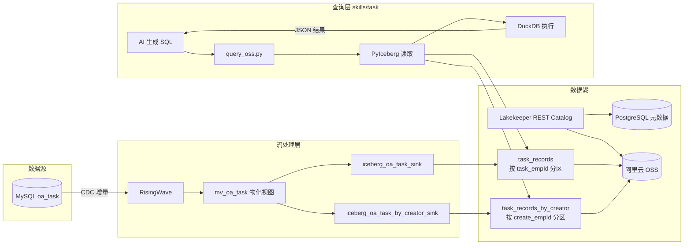

# OA 待办数据管道技术文档

本文档描述 **MySQL CDC → RisingWave → Lakekeeper Iceberg (OSS)** 数据写入流水线，以及 **`skills/task`** 自然语言查询技能的读取架构、部署步骤与运维要点。

---

## 1. 系统概览

### 1.1 整体架构



### 1.2 职责划分

| 模块 | 路径 | 职责 |
|------|------|------|
| 基础设施 | `risingwave/` | Docker 编排 RisingWave + Lakekeeper + PostgreSQL |
| CDC 写入任务 | `risingwave/task/mysql_cdc_to_oss/` | MySQL 增量同步、物化视图、Iceberg Sink |
| 查询技能 | `skills/task/` | NL-to-SQL、只读查询 Iceberg 表、返回业务结果 |

**核心原则**：写入与查询分离。RisingWave 持续负责数据新鲜度；`skills/task` 仅读取，不调用 OA API 拉取待办、不写入 Iceberg。

---

## 2. 技术栈

| 层级 | 技术 | 版本/说明 |
|------|------|-----------|
| 源库 | MySQL | 表 `oa_task`，需开启 binlog + CDC 账号 |
| 流引擎 | RisingWave | `risingwavelabs/risingwave:latest`，单节点模式 |
| Catalog | Lakekeeper | REST Catalog，元数据存 PostgreSQL 16 |
| 对象存储 | 阿里云 OSS | S3 兼容 API，`path-style-access=false` |
| 表格式 | Apache Iceberg v2 | upsert + merge-on-read |
| 查询引擎 | DuckDB + PyIceberg + Polars | 内存 SQL 执行 |
| Agent 框架 | SkillForge | 通过 `SKILL.md` 驱动 AI 工作流 |

---

## 3. 目录结构

```
communicate-skills/
├── risingwave/
│   ├── docker-compose.yml          # RisingWave + Lakekeeper + PG + bootstrap
│   ├── .env.example                # 基础设施配置
│   ├── requirements.txt            # Python 依赖
│   ├── lib/                        # 公用库（env / lakekeeper / iceberg schema）
│   └── task/mysql_cdc_to_oss/
│       ├── .env.example            # MySQL / Iceberg 表名
│       ├── sql/                    # RisingWave DDL（按序号执行）
│       │   ├── 00_create_mysql_cdc_table.rw.sql
│       │   ├── 01_create_materialized_view.rw.sql
│       │   ├── 02_create_lakekeeper_connection.rw.sql
│       │   ├── 03_create_iceberg_sink.rw.sql
│       │   └── 04_create_iceberg_sink_by_creator.rw.sql
│       └── scripts/
│           ├── apply_sql.py        # 按序执行 SQL
│           ├── ensure_iceberg_table.py
│           ├── check_rw_status.py
│           ├── check_iceberg_data.py
│           └── sync_mv.py          # 手动回补
│
└── skills/task/
    ├── SKILL.md                    # AI 协作指南（意图映射 + SQL 规范）
    ├── assets/config.yaml          # Lakekeeper / OSS / 认证配置
    └── scripts/
        ├── query_oss.py            # 只读查询入口
        ├── config.py               # Pydantic 配置加载
        └── utils/
            ├── lakekeeper_iceberg.py
            ├── auth.py
            └── logging.py
```

---

## 4. 部署步骤

### 4.1 前置条件

- Docker / Docker Compose
- Python 3.10+
- MySQL 已开启 binlog（`ROW` 格式），并为 CDC 创建专用账号
- 阿里云 OSS Bucket 及 AccessKey（与 Lakekeeper warehouse 一致）

### 4.2 配置环境变量

两层 `.env` 分工明确：

```bash
# 1. 基础设施
cp risingwave/.env.example risingwave/.env

# 2. CDC 任务
cp risingwave/task/mysql_cdc_to_oss/.env.example \
   risingwave/task/mysql_cdc_to_oss/.env
```

编辑后填入密钥，关键变量如下。

**`risingwave/.env`（基础设施）**

| 变量 | 说明 | 示例 |
|------|------|------|
| `RW_HOST` / `RW_PORT` | RisingWave SQL 端点 | `127.0.0.1:4566` |
| `LAKEKEEPER_CATALOG_URI` | Docker 内访问地址 | `http://lakekeeper:8181/catalog/` |
| `LAKEKEEPER_CATALOG_URI_HOST` | 宿主机访问地址 | `http://127.0.0.1:8181/catalog/` |
| `LAKEKEEPER_WAREHOUSE` | Warehouse 名称 | `xmh-analysis` |
| `OSS_BUCKET` | OSS Bucket | `xmh-analysis` |
| `OSS_KEY_PREFIX` | 数据前缀 | `iceberg` |
| `OSS_REGION` / `OSS_ENDPOINT` | 区域与端点 | `cn-beijing` |
| `OSS_ACCESS_KEY` / `OSS_SECRET_KEY` | OSS 凭证 | （必填） |

**`task/mysql_cdc_to_oss/.env`（CDC 任务）**

| 变量 | 说明 | 示例 |
|------|------|------|
| `MYSQL_HOST` / `MYSQL_PORT` | MySQL 地址 | `10.6.6.88:3306` |
| `MYSQL_USER` / `MYSQL_PASSWORD` | CDC 账号 | |
| `MYSQL_DATABASE` / `MYSQL_TABLE` | 源库表 | `xmhshop20141223.oa_task` |
| `MYSQL_SERVER_ID` | CDC server id（唯一） | `5410` |
| `CATALOG_DATABASE` | Iceberg namespace | `task_data_lakekeeper` |
| `CATALOG_TABLE` | 主表（按待办人分区） | `task_records` |
| `CATALOG_TABLE_BY_CREATOR` | 副表（按创建人分区） | `task_records_by_creator` |

### 4.3 启动 Docker 栈

在仓库根目录执行：

```bash
docker compose \
  --env-file risingwave/.env \
  --env-file risingwave/task/mysql_cdc_to_oss/.env \
  -f risingwave/docker-compose.yml up -d
```

启动后服务端点：

| 服务 | 地址 | 说明 |
|------|------|------|
| RisingWave SQL | `localhost:4566` | PostgreSQL 协议 |
| RisingWave Dashboard | `http://localhost:5691` | 监控面板 |
| Lakekeeper UI | `http://localhost:8181/ui/warehouse` | Catalog 管理 |
| Lakekeeper PG | `localhost:8433` | `postgres/postgres` |

`lakekeeper-bootstrap` 容器会自动完成：
1. Lakekeeper 初始化（accept terms）
2. 创建 warehouse，绑定 OSS 存储配置

### 4.4 安装 Python 依赖

```bash
pip install -r risingwave/requirements.txt
```

`skills/task` 额外依赖（SkillForge 环境通常已包含）：

```
pyiceberg, duckdb, polars, pyarrow, typer, pydantic-settings
```

### 4.5 执行 CDC 流水线

```bash
cd risingwave/task/mysql_cdc_to_oss
python scripts/apply_sql.py --sql-dir sql
```

执行顺序（由 `apply_sql.py` 自动排序）：

| 步骤 | SQL 文件 | 动作 |
|------|----------|------|
| 1 | `00_create_mysql_cdc_table.rw.sql` | 创建 MySQL CDC 源表 `mysql_oa_task_cdc` |
| 2 | `01_create_materialized_view.rw.sql` | 创建物化视图 `mv_oa_task` |
| 3 | `02_create_lakekeeper_connection.rw.sql` | 创建 Iceberg REST 连接 `lakekeeper_conn` |
| 4 | `03_create_iceberg_sink.rw.sql` | Sink → `task_records`（`partition_by=task_empId`） |
| 5 | `04_create_iceberg_sink_by_creator.rw.sql` | Sink → `task_records_by_creator`（`partition_by=create_empId`） |

执行 Sink 前，`apply_sql.py` 会自动调用 `ensure_iceberg_table.py` 在 Lakekeeper 中预建分区表。

**仅重建 Sink**（CDC/MV 已存在时）：

```bash
python scripts/apply_sql.py --sink-only
```

### 4.6 配置查询技能

编辑 `skills/task/assets/config.yaml`，确保与 RisingWave 侧一致：

```yaml
s3:
  bucket: "xmh-analysis"
  prefix: "iceberg"
  endpoint_url: "https://oss-cn-beijing.aliyuncs.com"
  region: "cn-beijing"
  access_key_id: "..."
  secret_access_key: "..."

lakekeeper:
  catalog_uri: "http://127.0.0.1:8181/catalog/"
  warehouse: "xmh-analysis"
  namespace: "task_data_lakekeeper"
  table: "task_records"
  table_by_creator: "task_records_by_creator"
```

配置加载优先级：**环境变量 (`TASK__*`) > config.yaml > 默认值**。

### 4.7 验证

```bash
# RisingWave 对象状态
python scripts/check_rw_status.py

# Iceberg 表数据
python scripts/check_iceberg_data.py

# 查询技能预览
cd skills/task
python scripts/query_oss.py preview --limit 5
python scripts/query_oss.py run --sql "SELECT COUNT(*) AS total FROM task_records"
```

---

## 5. 数据流技术细节

### 5.1 MySQL CDC 源表

- Connector：`mysql-cdc`
- 模式：单表 CDC（`database.name` + `table.name`），适合本地 Docker，不扫描整库
- 主键：`id`（对应输出 `task_id`）
- 列定义参考 `scripts/gen_cdc_schema.py`（与 MySQL `oa_task` 对齐）

### 5.2 物化视图 `mv_oa_task`

```sql
CREATE MATERIALIZED VIEW mv_oa_task AS
SELECT *
FROM mysql_oa_task_cdc
WHERE create_time IS NULL OR create_time <= now();
```

- 过滤未来创建时间的记录
- 字段结构与 OA API `api/Task/GetAllTask` 返回对齐
- 作为两个 Iceberg Sink 的统一数据源

### 5.3 双表分区策略

为优化不同查询场景，同一份 MV 数据写入两张分区表：

| 表名 | 分区字段 | 优化场景 |
|------|----------|----------|
| `task_records` | `task_empId` | 我的待办、待我处理、我完成的、待验收 |
| `task_records_by_creator` | `create_empId` | 我发起的 |

Sink 配置要点：

- `type = 'upsert'`，`primary_key = 'task_id'`
- `write_mode = 'merge-on-read'`
- `commit_checkpoint_interval = 1`（每条变更尽快提交）
- `sync_time = COALESCE(update_time, create_time)`（不用 `NOW()`）

### 5.4 Iceberg Schema

完整列定义见 `risingwave/lib/task_iceberg.py`：

| 列名 | 类型 | 说明 |
|------|------|------|
| `task_id` | BIGINT | 主键，required |
| `task_title` | VARCHAR | 待办标题 |
| `type_name` | VARCHAR | 类型名称 |
| `task_content` | VARCHAR | 内容摘要 |
| `task_empName` / `task_empId` | VARCHAR / INT | 待办人 |
| `create_empName` / `create_empId` | VARCHAR / INT | 创建人 |
| `check_emp_name` / `check_emp_id` | VARCHAR / INT | 验收人 |
| `create_time` | TIMESTAMP | 创建时间（naive） |
| `task_status` | INT | 0=进行中，1=已完成，2=超期完成，3=已验收 |
| `task_status_text` | VARCHAR | 状态文本 |
| `task_endtime` / `end_time` | TIMESTAMP | 截止/结束时间 |
| `task_link` | VARCHAR | 链接 |
| `task_deptName` | VARCHAR | 部门 |
| `is_user_send` | INT | 是否用户发起 |
| `confirm_time` | TIMESTAMP | 确认时间 |
| `page_id` / `page_id_text` | BIGINT / VARCHAR | 场景分类（查询层不展示） |
| `sync_time` | TIMESTAMP | 同步时间 |

表属性：`format-version=2`，`write.upsert.enabled=true`，`write.update.mode=merge-on-read`。

### 5.5 OSS 数据路径

实际数据位于：

```
oss://{OSS_BUCKET}/{OSS_KEY_PREFIX}/
```

默认：`oss://xmh-analysis/iceberg/`，**不是** bucket 根目录下的 `task_data/`。

---

## 6. skills/task 查询层

### 6.1 架构：AI 大脑 + 脚本手脚

```
用户自然语言 → AI 理解意图 → 生成 DuckDB SQL → query_oss.py 执行 → 业务语言回答
```

- AI 负责：意图识别、SQL 生成、结果解读
- 脚本负责：Schema 获取、Iceberg 读取、SQL 执行、安全校验
- **禁止** AI 猜测列名或直接处理原始数据

### 6.2 查询执行流程

`query_oss.py run` 内部步骤：

1. **用户身份注入**：从上下文 token 解析 `current_user_id`，替换 SQL 中的 `{current_user_id}`
2. **只读校验**：拦截 `INSERT/UPDATE/DELETE/DROP/ALTER/CREATE` 等写操作
3. **分区路由**：WHERE 含 `create_empId` → 读 `task_records_by_creator`；否则读 `task_records`
4. **谓词下推**：简单 `AND` 等值条件转为 PyIceberg `row_filter`，减少扫描量
5. **列裁剪**：从 SELECT / WHERE 提取所需列，减少 IO
6. **DuckDB 执行**：Arrow Table 注册为 `task_records` 虚拟表，执行 AI 生成的 SQL
7. **输出**：stdout 为 JSON，进度日志在 stderr

### 6.3 意图 → SQL 映射（核心规则）

| 用户说法 | SQL 条件 |
|----------|----------|
| 我的待办 / 我相关的 | `task_empId = {current_user_id}` |
| 待我处理 / 进行中 | `task_empId = {current_user_id} AND task_status = 0` |
| 我发起的 | `create_empId = {current_user_id}` |
| 我完成的 | `task_empId = {current_user_id} AND task_status IN (1, 2)` |
| 待验收 | `check_emp_id = {current_user_id} AND task_status IN (1, 2)` |
| 已验收 | `task_empId = {current_user_id} AND task_status = 3` |

硬性规则：
- 用户提到「我」时，必须加用户过滤条件
- 「进行中」「处理中」「待处理」必须包含 `task_status = 0`
- 不要添加 `LIMIT`（返回全部结果）
- 简单统计用 `COUNT(*)`，数据已按 `task_id` 去重

### 6.4 脚本命令

```bash
# 只读查询（Agent 主要入口）
python scripts/query_oss.py run --sql "SELECT COUNT(*) AS total FROM task_records WHERE task_empId = {current_user_id}"

# 预览表数据
python scripts/query_oss.py preview --limit 5
```

Agent 调用建议 `timeout ≥ 60` 秒（PyIceberg 读取可能较慢）。

### 6.5 认证与上下文

`config.yaml` 中配置：

| 配置项 | 说明 |
|--------|------|
| `cookie_name` / `header_name` | OA token 传递方式 |
| `context.user_id` | 环境变量 `CONTEXT_USER_ID` |
| `context.token` | 环境变量 `CONTEXT_METADATA_ACCESS_TOKEN` |
| `task_api.user_info_url` | 解析当前用户 ID（不拉取待办数据） |

---

## 7. 运维操作

### 7.1 健康检查

```bash
# RisingWave：Sink / Connection / MV 行数
python risingwave/task/mysql_cdc_to_oss/scripts/check_rw_status.py

# Iceberg：表快照与记录数
python risingwave/task/mysql_cdc_to_oss/scripts/check_iceberg_data.py

# 查询技能连通性
cd skills/task && python scripts/query_oss.py preview
```

### 7.2 手动回补

当 Sink 异常或需要全量刷新 Iceberg 表时：

```bash
cd risingwave/task/mysql_cdc_to_oss
python scripts/sync_mv.py              # 全量
python scripts/sync_mv.py --limit 100  # 测试
```

从 `mv_oa_task` 读取 → ETL（`skills/task/scripts/sync.py` 的 `etl_task_records`）→ 写入 Iceberg。

### 7.3 仅重建 Iceberg 表

```bash
python scripts/ensure_iceberg_table.py
python scripts/apply_sql.py --sink-only
```

### 7.4 停止服务

```bash
docker compose -f risingwave/docker-compose.yml down
```

---

## 8. 故障排查

| 现象 | 原因 | 处理 |
|------|------|------|
| `A warehouse 'xxx' does not exist` | bootstrap 失败 | `docker logs risingwave-lakekeeper-bootstrap-1` |
| `Failed to load iceberg table` | 表未创建或 schema 不匹配 | `python scripts/ensure_iceberg_table.py` |
| `Unresolved SQL placeholders` | `.env` 缺变量 | 检查两层 `.env` 是否完整 |
| CDC 无数据 | MySQL binlog / 网络 / server_id 冲突 | 检查 MySQL CDC 配置与 `MYSQL_SERVER_ID` 唯一性 |
| 查询慢 | 未命中分区路由或全表扫描 | 确认 SQL 含 `task_empId` 或 `create_empId` 过滤 |
| `task_id` 类型错误 | RW 中 id 为 INT | Sink 使用 `CAST(id AS BIGINT)` |
| OSS 路径找不到数据 | 前缀配置不一致 | 确认 `OSS_KEY_PREFIX=iceberg` |

---

## 9. 环境变量对照表

RisingWave 侧与 Skill 侧需保持一致的配置：

| 概念 | RisingWave `.env` | Skill `config.yaml` |
|------|-------------------|---------------------|
| OSS Bucket | `OSS_BUCKET` | `s3.bucket` |
| OSS 前缀 | `OSS_KEY_PREFIX` | `s3.prefix` |
| OSS 端点 | `OSS_ENDPOINT` | `s3.endpoint_url` |
| OSS 区域 | `OSS_REGION` | `s3.region` |
| Catalog URI | `LAKEKEEPER_CATALOG_URI_HOST` | `lakekeeper.catalog_uri` |
| Warehouse | `LAKEKEEPER_WAREHOUSE` | `lakekeeper.warehouse` |
| Namespace | `CATALOG_DATABASE` | `lakekeeper.namespace` |
| 主表 | `CATALOG_TABLE` | `lakekeeper.table` |
| 创建人表 | `CATALOG_TABLE_BY_CREATOR` | `lakekeeper.table_by_creator` |

---

## 10. 相关文档

- [risingwave/README.md](../risingwave/README.md) — 基础设施快速入门
- [risingwave/task/mysql_cdc_to_oss/README.md](../risingwave/task/mysql_cdc_to_oss/README.md) — CDC 任务说明
- [skills/task/SKILL.md](../skills/task/SKILL.md) — AI 协作规范与 SQL 模板
